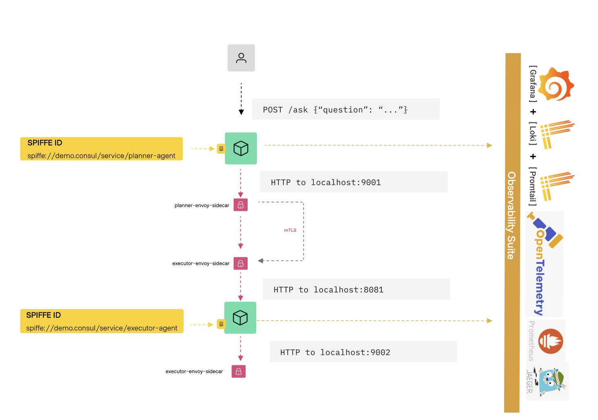

# smolagents Observability: Consul Connect, Vault PKI, and OpenTelemetry
This repo is the running version of the design walked through in  . A planner and an executor smolagents agent run behind a Consul Connect mesh, with mTLS enforced at the Envoy sidecar layer using SPIFFE identities issued by Vault PKI. Every agent.run() produces an OpenTelemetry trace via OpenInference instrumentation; every step emits structured audit logs to Loki, correlated by trace ID. 
A pre-built Grafana dashboard ties traces, metrics, and logs into one view. The whole stack runs locally on Docker Compose with one task up.

## Architecture




## What this shows

- **Traces**: `openinference-instrumentation-smolagents` auto-instruments every `agent.run()` and tool invocation. The planner→executor delegation appears as a parent/child trace tree in Jaeger, including the explicit `planner.delegate` span wrapping the cross-service HTTP call.
- **Metrics**: per-step counters and histograms for throughput, latency percentiles, LLM token counts, tool call rates, and context window growth, emitted from smolagents `step_callbacks` via the OTel metrics SDK.
- **Audit logs**: one structured JSON record per step flows to Loki. Each record carries the active `trace_id`, so clicking a log line in Grafana jumps to the matching Jaeger trace via derived fields.
- **Service mesh**: Consul Connect with default-deny intentions and Envoy sidecars. The agents call each other over plain localhost; mTLS is enforced at the proxy layer using SPIFFE leaf certificates signed by Vault.

## Prerequisites

- Docker + Docker Compose v2
- [Task](https://taskfile.dev) (`brew install go-task`)
- Terraform ≥ 1.5
- `jq`, `curl`
- An LLM: remote API (OpenAI, Anthropic, Groq) or a local Ollama instance

## Quick start

```sh
cp .env.example .env
# Edit .env — set LLM_MODEL and the matching API key (or OLLAMA_BASE_URL for a local instance)
task up     # pull images, start Vault + Consul + agents + full observability stack
task demo   # send 10 varied tasks through the planner to populate every dashboard panel
```

`task up` starts all containers, initialises Vault dev mode, applies Terraform (Vault PKI + Consul intentions), registers services in Consul, and brings up the Envoy sidecars. First run takes about a minute while images pull.

| UI | URL | Credentials |
|----|-----|-------------|
| Grafana | <http://localhost:3000> | admin / admin (anonymous access also enabled) |
| Jaeger | <http://localhost:16686> | — |
| Prometheus | <http://localhost:9090> | — |
| Consul | <http://localhost:8500> | — |
| Vault | <http://localhost:8200> | token: `root` |

In Grafana, open **Agent Observability → Agent Operations**. Every panel should have data after a single `task demo` run. Click any row in the **All Agent Steps** panel to jump to the matching Jaeger trace.

Other useful targets:

```sh
task health           # check every service responds
task logs:agents      # tail planner + executor logs
task logs:otel        # tail OTel Collector logs
task consul:status    # show Consul service catalogue and intentions
```

## LLM configuration

The agents use [LiteLLM](https://docs.litellm.ai) so any provider it supports works without code changes. Set `LLM_MODEL` and the matching key in `.env`:

| Provider | `LLM_MODEL` | Key variable |
|----------|-------------|--------------|
| OpenAI | `gpt-4o-mini` | `OPENAI_API_KEY` |
| Anthropic | `anthropic/claude-3-5-haiku-20241022` | `ANTHROPIC_API_KEY` |
| Groq | `groq/llama-3.1-70b-versatile` | `GROQ_API_KEY` |
| Ollama (local) | `ollama/qwen2.5-coder:7b` | *(none)* |

For Ollama, start it on the host before `task up`, then set `OLLAMA_BASE_URL=http://host.docker.internal:11434` in `.env`. Any model available via `ollama pull` works.

## Repo layout

```text
.
├── agents/
│   ├── shared/         # telemetry init, step callbacks, tool implementations
│   ├── planner/        # FastAPI + CodeAgent + delegate_to_executor tool
│   └── executor/       # FastAPI + CodeAgent + search/api/code tools
├── bin/                # Vault PKI setup, Consul service registration, demo traffic
├── consul/
│   ├── config.hcl      # Consul dev-server config (Connect enabled)
│   └── sidecars/       # generated Envoy bootstrap configs (gitignored)
├── grafana/
│   ├── dashboards/     # agent-operations.json, mesh-health.json
│   └── provisioning/   # auto-loaded datasource and dashboard configuration
├── images/             # screenshots and architecture diagrams
├── loki/               # single-binary Loki config (OTLP HTTP receiver)
├── otel-collector/     # OTLP receiver, redaction, tail sampling, fanout config
├── prometheus/         # remote-write receiver config + sidecar scrape targets
├── terraform/          # Vault PKI engine + Consul Connect intentions
├── docker-compose.yml
└── Taskfile.yml
```

## Docs

- [Architecture](docs/architecture.md) — component map, agent design, mesh setup, OTel Collector pipeline, design rationale
- [Dashboards](docs/dashboards.md) — how to read each Grafana dashboard row and panel
- [Traces](docs/traces.md) — Jaeger span structure and filtering tips
- [Metrics reference](docs/metrics.md) — every metric, label, and PromQL query


