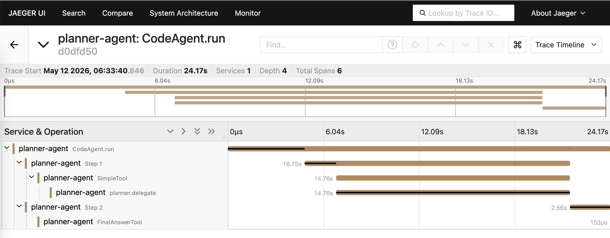

# Architecture

## Overview

The design goal is a complete observability picture of a multi-agent AI system — traces, metrics, and audit logs — without embedding observability logic into the agent business code. The two instrumentation surfaces are `openinference-instrumentation-smolagents`, which auto-instruments every agent run and tool call at the library level, and `step_callbacks`, which give access to per-step data (token counts, tool names, error types, memory depth) that the instrumentor does not expose as metrics.

The system splits into three concerns: the agents themselves, the mesh that carries traffic between them, and the observability stack that receives their telemetry. Each agent process is a FastAPI application wrapping a smolagents `CodeAgent`. Consul Connect manages service-to-service routing, enforces authorisation via intentions, and injects Envoy sidecar proxies that terminate mTLS using SPIFFE leaf certificates issued by Vault. The OpenTelemetry Collector sits in the middle of the telemetry path, handling redaction, tail sampling, and fanout to three backends.

None of the operational concerns — mTLS, identity, sampling policy, PII redaction — live in agent code. They are configuration on the infrastructure layer. This is the point: swapping the sampling policy or adding a new backend is a change to `otel-collector/config.yaml`, not a code change to either agent.


---

## Component map

**planner-agent** (`agents/planner/`) is a FastAPI service wrapping a smolagents `CodeAgent`. It holds one tool: `delegate_to_executor`, which POSTs the subtask to the executor's `/run` endpoint. The planner has no domain tools of its own; its sole job is decomposition and delegation. This keeps the planner's context window small and makes the trace tree obvious: every planner span that does real work is a delegation hop.

**executor-agent** (`agents/executor/`) is a FastAPI service wrapping a second `CodeAgent`. It holds three tools: `search_knowledge_base` (keyword search over a simulated internal knowledge base), `call_external_api` (simulated platform API for cluster health, telemetry, cost, and lease data), and `run_code_snippet` (sandboxed Python evaluation). Tool implementations live in `agents/shared/tools.py` and simulate realistic latency profiles with `time.sleep(uniform(...))` so the heatmap and P95 panels have interesting data.

**Envoy sidecars** (`planner-sidecar`, `executor-sidecar` in `docker-compose.yml`) share their respective agent's network namespace via `network_mode: service:<agent>`. Bootstrap configs are generated by `bin/register-services.sh` and stored in `consul/sidecars/` (gitignored). The sidecars serve their Prometheus metrics endpoint at `:19001/metrics`, which is what the mesh-health dashboard scrapes.

**OpenTelemetry Collector** (`otel-collector/config.yaml`) is the single OTLP ingress point for traces, metrics, and logs from both agents. It runs three separate pipelines fanning out to different backends. The Collector is also where PII redaction and tail sampling happen — neither agent process needs to know about those policies.

**Jaeger v2** (`jaegertracing/jaeger:2.1.0`) stores and queries traces. It accepts OTLP natively; no Jaeger-protocol shim is needed. The Collector sends spans to Jaeger's internal OTLP gRPC endpoint on the `mesh` Docker network.

**Prometheus** (`prom/prometheus:v3.0.1`) stores metrics. It runs with `--web.enable-remote-write-receiver` so the Collector can push via remote write, and `--enable-feature=native-histograms` to accept the native histogram format the OTel SDK emits. The Envoy sidecars are scraped directly by Prometheus (not through the Collector) to populate the mesh-health dashboard.

**Loki** (`grafana/loki:3.3.2`) stores audit logs. It accepts OTLP HTTP at `/otlp`, which is what the Collector's `otlphttp/loki` exporter targets. The `trace_id` field each audit record carries is what Grafana's derived-field config uses to link a Loki log line directly to its Jaeger trace.

**Grafana** (`grafana/grafana:11.4.0`) is fully provisioned on startup: datasources from `grafana/provisioning/datasources/`, dashboard definitions from `grafana/dashboards/`. Two dashboards are included: **Agent Operations** (throughput, latency, token economics, memory growth, step audit log) and **Consul Mesh Health** (mTLS handshake rates, allowed vs denied connections, Envoy upstream latency). No manual import survives a `task clean`; provisioning is the only durable form.

**Vault** (`hashicorp/vault:1.18`) runs in dev mode and acts as a root CA. Terraform (`terraform/vault.tf`) provisions a PKI secrets engine at `pki_root`, signs a Consul Connect intermediate at `pki_int`, and creates a token with the `consul-connect` policy that Consul uses to request leaf signing. Vault dev mode is in-memory and single-node; it is pre-unsealed and requires no operator intervention.

**Consul** (`hashicorp/consul:1.20`) runs as a single dev-mode server with Connect enabled (`consul/config.hcl`). It acts as the service catalogue and sidecar controller. Terraform (`terraform/consul.tf`) seeds the intentions: a wildcard default-deny, then an explicit allow for `planner-agent → executor-agent`, and allows for both agents to reach `otel-collector`.

---

## Agent design

Both agents are `CodeAgent` instances from smolagents 1.14.0, using `LiteLLMModel` as the model abstraction. The CodeAgent runs a ReAct loop: at each step it generates Python code that calls one or more tools, executes that code, inspects the result, and decides whether to call `final_answer` or take another step.

```python
# agents/planner/main.py
agent = CodeAgent(
    tools=[delegate_to_executor],
    model=LiteLLMModel(model_id=os.environ.get("LLM_MODEL", "gpt-4o-mini"), ...),
    max_steps=int(os.environ.get("AGENT_MAX_STEPS", "5")),
    planning_interval=int(os.environ.get("AGENT_PLANNING_INTERVAL", "3")),
    step_callbacks=[audit_callback, metrics_callback],
    ...
)
```

`planning_interval=3` means the agent inserts an explicit planning step every three action steps, which shows up as `PlanningStep` events in the callbacks and as `agent_planning_steps_total` in Prometheus.

**Callbacks** (`agents/shared/callbacks.py`) are the primary instrumentation hook. Both `audit_callback` and `metrics_callback` are registered on every agent. They run after each step completes, receiving the step object and the agent instance.

`audit_callback` writes a JSON record per step to the `agent.audit` Python logger:

```python
record = {
    "ts": time.time(),
    "agent": agent.name,
    "type": type(step).__name__,   # ActionStep | PlanningStep | FinalAnswerStep
    "trace_id": _current_trace_id(),
    # ActionStep only:
    "step_num": step.step_number,
    "tool": step.tool_calls[0].name if step.tool_calls else "none",
    "duration_s": step.duration,
    "error": ...,
    "input_tokens": ...,
    "output_tokens": ...,
}
```

The `trace_id` is extracted from the current OTel span context. Because `SmolagentsInstrumentor` wraps `agent.run()` in a span, this field is populated for every step inside a run. Grafana's derived-field config on the Loki datasource turns it into a clickable link to Jaeger.

`metrics_callback` emits per-step OTel metrics. Instruments defined in `callbacks.py`:

| Instrument | Type | Labels |
|---|---|---|
| `agent_step_total` | Counter | `agent`, `tool` |
| `agent_step_duration_seconds` | Histogram | `agent`, `tool` |
| `agent_step_errors_total` | Counter | `agent`, `tool`, `error_type` |
| `agent_memory_messages` | Histogram | `agent` |
| `agent_planning_steps_total` | Counter | `agent` |
| `agent_max_steps_hit_total` | Counter | `agent` |
| `agent_final_answer_total` | Counter | `agent` |
| `llm_calls_total` | Counter | `model` |
| `llm_call_duration_seconds` | Histogram | `model` |
| `llm_prompt_tokens` | Histogram | `model` |
| `llm_completion_tokens` | Histogram | `model` |
| `llm_inter_token_seconds` | Histogram | `model` |
| `llm_call_errors_total` | Counter | `model`, `error_type` |

Token counts come from `step.model_output_message.raw.usage` (the raw LiteLLM `ModelResponse` object). `openinference-instrumentation-smolagents` 0.1.7 does not emit LLM-kind spans, so these metrics are the only source of per-call token and latency data.

**Telemetry initialisation** (`agents/shared/telemetry.py`) configures all three OTel providers once per process via `init_telemetry(service_name)`. A `TracerProvider` with a `BatchSpanProcessor`, a `MeterProvider` with a `PeriodicExportingMetricReader` at 10-second intervals, and a `LoggerProvider` with a `BatchLogRecordProcessor` are all wired to the same OTLP gRPC endpoint (`OTEL_EXPORTER_OTLP_ENDPOINT`, defaulting to `http://otel-collector:4317`). `SmolagentsInstrumentor` is applied once per process after the providers are registered, so every AGENT and TOOL span carries the correct `service.name` resource attribute. The `agent.audit` logger and the root logger both get an `OTLPLogHandler`, so structured audit records and application warnings alike flow through the Collector to Loki.

---

## Telemetry pipeline

Signal flow from agent code to dashboards:

```text
smolagents step_callbacks
  ├── metrics_callback  → OTLPMetricExporter (10s)  → OTel Collector → prometheusremotewrite → Prometheus
  └── audit_callback    → OTLPLogExporter (batched)  → OTel Collector → otlphttp/loki        → Loki

SmolagentsInstrumentor
  └── AGENT / TOOL spans → OTLPSpanExporter (batched) → OTel Collector → otlp/jaeger         → Jaeger

                                                                                      ↓
                                                                                   Grafana
                                                          (provisioned datasources: Jaeger, Prometheus, Loki)
```

The Collector config (`otel-collector/config.yaml`) runs three pipelines with distinct processor chains:

| Signal | Processor chain | Exporter |
|--------|----------------|----------|
| Traces | `memory_limiter → resource → attributes/redact → tail_sampling → batch` | `otlp/jaeger` |
| Metrics | `memory_limiter → resource → batch` | `prometheusremotewrite` |
| Logs | `memory_limiter → resource → batch` | `otlphttp/loki` |

`memory_limiter` is first in every pipeline. At 512 MiB limit and 128 MiB spike allowance, it refuses new data before the process OOMs rather than crashing silently.

`attributes/redact` hashes four span attributes before they leave the Collector: `llm.input_messages.0.message.content`, `llm.output_messages.0.message.content`, `input.value`, `output.value`. Hashing preserves the ability to confirm two calls had identical prompts (useful for cache debugging) while ensuring raw model input and output never reach Jaeger or any downstream system. This is enforced in the Collector rather than in agent code because the Collector is the deployment boundary you control.

`tail_sampling` applies three policies in order:

```yaml
policies:
  - name: keep-errors
    type: status_code
    status_code: { status_codes: [ERROR] }
  - name: keep-slow
    type: latency
    latency: { threshold_ms: 5000 }
  - name: baseline
    type: probabilistic
    probabilistic: { sampling_percentage: 5 }
```

Every trace with an ERROR span is kept. Every trace whose root span exceeds 5 seconds is kept. Five percent of remaining traces are kept as a baseline sample. `decision_wait: 10s` gives spans from all services time to arrive before the policy fires. Metrics are unsampled — they are not affected by this policy.

The `resource` processor upserts `deployment.environment: local` so Grafana variables that filter by environment work correctly without requiring every agent to set the attribute explicitly.

---

## Mesh and identity

Consul Connect handles service registration, intention enforcement, and Envoy sidecar lifecycle. The Consul agent config (`consul/config.hcl`) enables Connect and sets up the gRPC port (8502) used by sidecars to fetch their dynamic configuration from Consul's xDS API.

Terraform (`terraform/consul.tf`) seeds three intention config entries on startup:

- `*` → `*`: **deny** (default-deny for all services)
- `planner-agent` → `executor-agent`: **allow** (the core agent edge)
- `planner-agent`, `executor-agent` → `otel-collector`: **allow** (telemetry path)

Intentions are enforced at the Envoy proxy level, not in application code. The agents do not implement any authorisation checks; Envoy rejects connections that violate intentions before they reach the application.

Vault (`terraform/vault.tf`) acts as the upstream CA. Terraform provisions:

- `pki_root` mount: root CA, 30-day max lease
- `pki_int` mount: intermediate CA, signed by `pki_root`, used by Consul Connect as its signing authority
- `consul-connect` Vault policy granting the `pki_int/*` paths
- A long-lived token (720h) bound to that policy

Consul fetches its intermediate signing certificate from Vault and rotates leaf certificates automatically. The SPIFFE URI format is `spiffe://demo.consul/service/<service-name>` — the trust domain maps to the Consul datacenter, and the service name is the Consul service registration name.

Each agent container runs without a sidecar by default. `task up` calls `bin/register-services.sh`, which registers each service with Consul (using the HCL definitions in `agents/planner/consul-service.hcl` and `agents/executor/consul-service.hcl`), then calls `consul connect envoy -bootstrap` to generate Envoy bootstrap configs and writes them to `consul/sidecars/`. The sidecar containers in `docker-compose.yml` (`planner-sidecar`, `executor-sidecar`) mount that directory and share their agent's network namespace via `network_mode: service:<agent>`. From the agent's perspective, it talks to a local port; Envoy handles the mTLS handshake with the remote sidecar.

---

## Traces in practice

The Jaeger screenshot below shows a single planner run: `CodeAgent.run` as the root span, Step 1 calling `SimpleTool` (the `delegate_to_executor` tool), which wraps the delegation in a manual `planner.delegate` span, then Step 2 calling `FinalAnswerTool` after the executor returns.



The `planner.delegate` span (14.76s in this trace) is where the planner is waiting on the executor's HTTP response. OpenInference produces AGENT and TOOL spans from the planner side; the executor's internal spans appear as a linked child trace under the executor's service in Jaeger when W3C `traceparent` propagation is active through the mesh.

---

## Why each choice

**OpenInference for instrumentation.** Framework-agnostic semantic conventions for AI workloads. The same instrumentation works if you swap smolagents for LangGraph or LlamaIndex. The alternative — manual spans around every LLM call — would need updating whenever the agent framework changes its call graph.

**Step callbacks for metrics, not spans.** `openinference-instrumentation-smolagents` 0.1.7 does not emit LLM-kind spans with token counts. The callbacks read token usage directly from `step.model_output_message.raw.usage` after each step. This is more reliable than deriving metrics from spans server-side (via the Collector's `spanmetrics` connector) because the agent's resource attributes — particularly `service.name` — are already set correctly without needing Collector-side attribute promotion. It also means the metrics work the same way regardless of which observability backend is downstream of the Collector.

**Tail sampling at the Collector, not head sampling in the agent.** Agent runs are short (5–30 spans each) and heterogeneous (some fail, some are slow, most are routine). Head sampling would discard errors before the Collector sees them. Tail sampling lets the Collector see the full trace before deciding, so the keep-errors and keep-slow policies work correctly. Metrics are unsampled, so dashboards that show aggregate behaviour are not affected by the trace sampling rate.

**PII redaction in the Collector, not the agent.** The Collector is the chokepoint you trust. Agents may be misconfigured, run untrusted third-party code, or emit telemetry with prompt content accidentally. Centralising redaction in the Collector means it applies regardless of which agent emits the span, and it cannot be accidentally disabled by a code change to an individual agent.

**Loki for audit logs, not a separate log store.** The audit records need to be queryable alongside traces. Grafana's derived-field config links a Loki log line to a Jaeger trace via `trace_id` without any extra integration work. A separate log store would need its own Grafana datasource and lose the one-click trace correlation that makes the audit panel useful during an incident.

**Mesh-mediated mTLS, not application-layer TLS.** Neither agent process contains TLS code. Certificate rotation, cipher selection, and revocation are Consul's problem. The trade-off is that Consul and Envoy are now in the critical path for inter-agent calls; the benefit is that adding a new service to the mesh is a Consul registration, not a code change.

**Two separate agent processes.** Running planner and executor in the same process would collapse the cross-service call into an in-process function call. There would be no mTLS hop, no Envoy sidecar metrics, and the trace shape would be a single flat list of spans under one service name. The two-process architecture is what makes the mesh panels meaningful and the trace tree readable.

---

## Failure modes and limitations

**Model provider degradation.** If the configured LLM provider slows down or rate-limits, `agent_step_duration_seconds` P95 climbs and `llm_call_errors_total` increments. There is no circuit breaker or fallback model; the agent will hit `max_steps` or time out. The dashboard shows this; the system does not self-heal.

**OTel Collector outage.** Both agents export OTLP with `insecure=True` and no retry configuration beyond the SDK defaults. If the Collector is unavailable, spans and metrics are lost; the agents continue to serve requests. Audit logs written to the Python logger still appear in container stdout, so there is a fallback record — just not in Loki.

**No pre-execution tool hooks.** `step_callbacks` fire after a step completes, not before. If an agent step crashes the process (OOM, SIGKILL), the callback does not run and no audit record is emitted for that step. This is a smolagents limitation in 0.1.7; it is not compensated for in this repo.

**Max-steps detection is approximate.** The executor detects "hit max_steps" by inspecting `agent.memory.steps[-1]` after `.run()` returns (`agents/executor/main.py`, `record_max_steps_hit`). smolagents returns a result rather than raising in this case, so there is no clean exception to catch. The detection heuristic is: last step is an `ActionStep` and its step number equals `max_steps`. This can misfire if the agent completes exactly at `max_steps` with a valid final answer.

**Task-scope authorisation is not modelled.** Consul intentions allow `planner-agent → executor-agent` as a blanket rule. There is no per-task or per-user authorisation check. Any caller that can reach the planner's `/run` endpoint can cause it to delegate arbitrary subtasks to the executor.

**Token-cost estimates use a fixed rate.** The "Estimated Cost / Hour" panel in Grafana uses a hardcoded per-1K-tokens rate baked into the dashboard JSON. It does not fetch live pricing from the provider. For real cost tracking, integrate a billing stream or a token-pricing lookup service.

**Consul ACLs are disabled.** `consul/config.hcl` sets `acl { enabled = false }`. In this demo, Connect intentions provide the authorisation layer; ACLs would add another layer of defence in production but are unnecessary for the mesh demo to work.

---

## Running locally vs production

This repo is built to be cloned, started, and discarded. Several things would need to change for a production deployment.

**Vault**: Replace dev mode with a proper HA cluster (3 or 5 nodes), KMS-backed auto-unseal, and an audit device writing to a SIEM. The PKI engine TTLs should be tuned to the Consul Connect leaf cert lifetime. The `consul-connect` token should be replaced with a Vault auth method bound to a real service account (Kubernetes JWT, AWS IAM, or AppRole with short TTL).

**Consul**: Replace the single-node dev server with a 3- or 5-node cluster. Enable ACLs (`acl { default_policy = "deny" }`). Configure gossip encryption and TLS for the agent API.

**OTel Collector**: The single-process Collector in this demo is a single point of failure. Production deployments typically run a Collector agent on each host (or as a DaemonSet in Kubernetes) and a gateway tier for aggregation, tail sampling, and fanout. The gateway tier is where you increase `num_traces` and tune `decision_wait` to match actual traffic volume.

**Backends**: Jaeger, Prometheus, and Loki are single-node here. Replace with managed or clustered equivalents (Grafana Cloud, Tempo, Mimir, or self-hosted HA clusters). Prometheus remote write to Mimir gives you long-term retention without Prometheus local storage limits.

**Grafana**: Anonymous Admin access is convenient for a demo and catastrophic in production. Replace with SSO (OAuth2, SAML) and role-based access so dashboard viewers cannot modify datasources or alert rules.

**Agents**: Each agent is a single FastAPI process behind uvicorn with one worker. For production throughput, run multiple replicas behind a load balancer. The single `CodeAgent` per process is safe for concurrent requests because `agent.memory` resets on every `.run()` call, but you will need horizontal scaling rather than more workers per process to increase concurrency.

**Envoy sidecar injection**: In this repo, sidecar containers are started manually via `task up`. In Kubernetes, Consul's `consul-k8s` controller injects sidecars automatically. In Nomad, the `connect { sidecar_service {} }` block in the job spec handles lifecycle alongside the main task.
